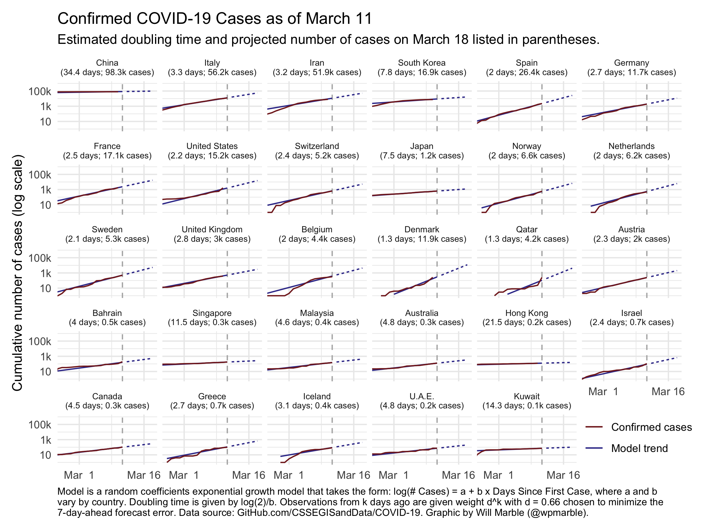

# Cross-national COVID-19 trends and 7-day forecast

Using data on confirmed cases of COVID-19 in countries across the world, I generate projections of the number of cases we can expect in each country in a week. Data are curated by [Johns Hopkins CSSE](https://github.com/CSSEGISandData). See methodology write-up at williammarble.co/blog/2020-03/covid-19-projections.html. 

